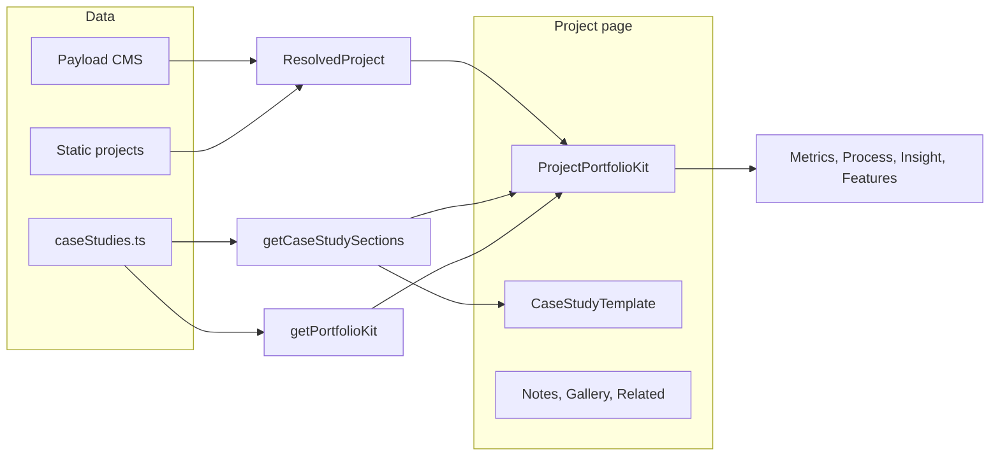

# Project Builder — Documentation

How project (case study) pages are built: data sources, components, and how to add or edit a project.

---

## 1. Overview

Each project has a detail page at **`/projects/[slug]`** (e.g. `/projects/kovon`, `/projects/ffp-dashboard`). The page is built from:

1. **Project data** — From CMS (Payload) or static fallback: title, oneLiner, year, roles, tags, moodImageUrl, impact, prototype, etc.
2. **Case study content** — Optional long-form copy in `src/content/caseStudies.ts`: summary, realProblem, approach, outcome, etc.
3. **Portfolio Kit data** — Optional structured blocks in `caseStudies.ts`: process steps, feature/tech items, insight quote author.
4. **Portfolio Kit components** — Reusable UI in `src/components/PortfolioKit.tsx` and the project layout in `src/components/ProjectPortfolioKit.tsx`.

---

## 2. File map

| File | Purpose |
|------|--------|
| `src/app/(site)/projects/[slug]/page.tsx` | Project detail page: loads project + case study + portfolio kit, renders ProjectPortfolioKit and rest of layout. |
| `src/components/ProjectPortfolioKit.tsx` | **Project builder** layout: Hero, BrowserMockup, MetricCards, ProcessSteps, InsightCard, FeatureItems. Uses project + case study + portfolioKit. |
| `src/components/PortfolioKit.tsx` | Reusable building blocks: ProjectHero, BrowserMockup, MetricCard, InsightCard, ProcessStep, ProcessSteps, FeatureItem. |
| `src/content/caseStudies.ts` | Case study copy and portfolio kit data **keyed by project slug**. |
| `src/content/projects.ts` | Static project list (fallback when CMS unavailable). |
| `src/lib/cms/` | CMS types, payload config, project resolution. |

---

## 3. Data sources

### 3.1 Project (ResolvedProject)

Comes from **Payload CMS** (or static `projects.ts`). Used for:

- **Hero**: `title`, `oneLiner`, `roles[0]`, `year`, `tags`
- **Prototype link**: `prototype.inAppPrototypeHref` or `#prototype` for Figma, or `links` "Live demo"
- **Screenshot**: `moodImageUrl` (or placeholder)
- **Metrics**: `impact[]` → first 3 shown as MetricCards (`label`, `value`)

Relevant type: `ResolvedProject` in `src/lib/cms/types.ts` (alias of `Project` from `src/content/projects.ts`).

### 3.2 Case study sections (CaseStudySections)

In **`src/content/caseStudies.ts`**, keyed by **slug** in `caseStudyBySlug`. Used for:

- **InsightCard (problem)**: `realProblem` as quote; optional `portfolioKit.insightAuthor`
- **Fallback insight**: If no `realProblem`, `outcome` can be shown as insight
- **Long-form block**: `CaseStudyTemplate` uses full sections (summary, approach, solutionConcept, outcome, etc.)

**Slug mapping**: `kovon`, `emission-compliance` (CAESAR), `automation` (SAP), `ffp-dashboard` (FFP).

### 3.3 Portfolio Kit data (PortfolioKitData)

In **`src/content/caseStudies.ts`**, keyed by **slug** in `portfolioKitBySlug`. Optional per project.

| Field | Type | Use |
|-------|------|-----|
| `processSteps` | `{ number, title, desc }[]` | "The Process" — numbered steps with connector line. |
| `featureItems` | `{ icon, title, desc }[]` | "Tech & approach" — icon is Lucide name (Layout, Database, Lock, FileCheck, ShieldCheck, Zap, Search). |
| `insightAuthor` | `string` | Author line under the problem quote (e.g. "Lead Engineer"). |

**Projects with kit data**: `ffp-dashboard`, `kovon`. Others get hero + screenshot + impact only (if any).

---

## 4. Portfolio Kit components (building blocks)

All in **`src/components/PortfolioKit.tsx`**. Use design tokens; accept `className`.

### ProjectHero

Hero block: tags, year, title, subtitle, role, "View Live" link.

| Prop | Type | Description |
|------|------|-------------|
| `title` | string | Project name. |
| `subtitle` | string | One-liner. |
| `role` | string | e.g. "Lead Designer". |
| `year` | string | e.g. "2024". |
| `tags` | string[] | Badges (e.g. Enterprise, Automotive). |
| `link` | string? | Prototype or live URL. |

### BrowserMockup

Browser chrome + screenshot.

| Prop | Type | Description |
|------|------|-------------|
| `src` | string | Image URL. |
| `alt` | string? | Alt text. |
| `urlBar` | string? | Optional URL bar text. |
| `useNextImage` | boolean? | `true` for same-origin (Next Image), `false` for external (img). |

### MetricCard

Single metric (value + label + optional trend/suffix).

| Prop | Type | Description |
|------|------|-------------|
| `value` | string \| number | Main number. |
| `label` | string | e.g. "Faster Triage". |
| `trend` | string? | e.g. "+12% YoY". |
| `suffix` | string? | e.g. "%", "M". |
| `icon` | LucideIcon? | Default Zap. |

### InsightCard

Quote block — problem or insight.

| Prop | Type | Description |
|------|------|-------------|
| `quote` | string | Quoted text. |
| `author` | string? | e.g. "Lead Engineer". |
| `type` | `'insight' \| 'problem'` | problem = red accent; insight = default. |

### ProcessStep / ProcessSteps

One step: number, title, description, optional connector line. **ProcessSteps** takes `steps[]` and sets `isLast` automatically.

| Prop (ProcessStep) | Type | Description |
|--------------------|------|-------------|
| `number` | string \| number | e.g. "01". |
| `title` | string | Step title. |
| `desc` | string | Short description. |
| `isLast` | boolean? | Hides connector line. |

### FeatureItem

One feature/tech row: icon + title + description.

| Prop | Type | Description |
|------|------|-------------|
| `icon` | LucideIcon | Lucide component. |
| `title` | string | e.g. "React Frontend". |
| `desc` | string | Short line. |

---

## 5. ProjectPortfolioKit (project builder)

**File**: `src/components/ProjectPortfolioKit.tsx`

**Props**: `project` (ResolvedProject), `caseStudy` (CaseStudySections | null), `portfolioKit` (PortfolioKitData | null).

**Renders** (in order):

1. **ProjectHero** — from project (title, oneLiner, role, year, tags, prototype link).
2. **BrowserMockup** — project.moodImageUrl or placeholder; URL bar from client if set.
3. **MetricCard grid** — first 3 from project.impact (value, label).
4. **Two-column block** (if any data):
   - Left: **ProcessSteps** from portfolioKit.processSteps.
   - Right: **InsightCard** (realProblem + insightAuthor), then **FeatureItem** list from portfolioKit.featureItems.
5. If no realProblem but caseStudy.outcome exists: **InsightCard** (type insight) with outcome.

**Icon map** (for featureItems.icon string): Layout, Database, Lock, FileCheck, ShieldCheck, Zap, Search. Unknown names fall back to Layout.

---

## 6. How to add a new project

### Via CMS (Payload)

1. Add the project in **Admin** (`/admin`): set slug, title, oneLiner, year, roles, tags, moodImageUrl, impact, prototype/links, etc.
2. **Case study copy**: In `src/content/caseStudies.ts`, add an entry to `caseStudyBySlug` with the **same slug** and a `CaseStudySections` object (summary, realProblem, approach, outcome, etc.).
3. **Portfolio Kit** (optional): In `caseStudies.ts`, add to `portfolioKitBySlug[slug]` a `PortfolioKitData` with `processSteps`, `featureItems`, `insightAuthor` as needed.

### Static only (no CMS)

1. In `src/content/projects.ts`, add the project to the static list (slug, title, oneLiner, year, roles, tags, etc.).
2. Same as steps 2–3 above for case study and portfolio kit in `caseStudies.ts`.

---

## 7. How to edit a project’s case study or kit

- **Case study text**: Edit the object for that slug in `caseStudyBySlug` in `src/content/caseStudies.ts` (e.g. change `realProblem`, `outcome`, `approach`).
- **Process steps**: Edit `portfolioKitBySlug[slug].processSteps` in the same file; use `{ number, title, desc }[]`.
- **Tech/feature items**: Edit `portfolioKitBySlug[slug].featureItems`; `icon` must be one of: Layout, Database, Lock, FileCheck, ShieldCheck, Zap, Search (or add the icon in `ProjectPortfolioKit.tsx` iconMap).
- **Insight author**: Set `portfolioKitBySlug[slug].insightAuthor` (e.g. `"Lead Engineer"`).

---

## 8. Other case study features (same file)

- **Bento cards** (Apple-style grid): `bentoCardsBySlug`, `getBentoCards(slug)` — currently only FFP; not used on the main project page when using ProjectPortfolioKit.
- **Technical specs accordion**: `technicalSpecsBySlug`, `getTechnicalSpecs(slug)` — rendered below the main content on the project page; add `{ title, body }[]` for a slug to show an accordion.

---

## 9. Demo page

**`/examples/portfolio-kit`** — Shows Portfolio Kit components with sample Automotive and Fintech content. Use it as a reference for props and layout. File: `src/app/(site)/examples/portfolio-kit/page.tsx`.
